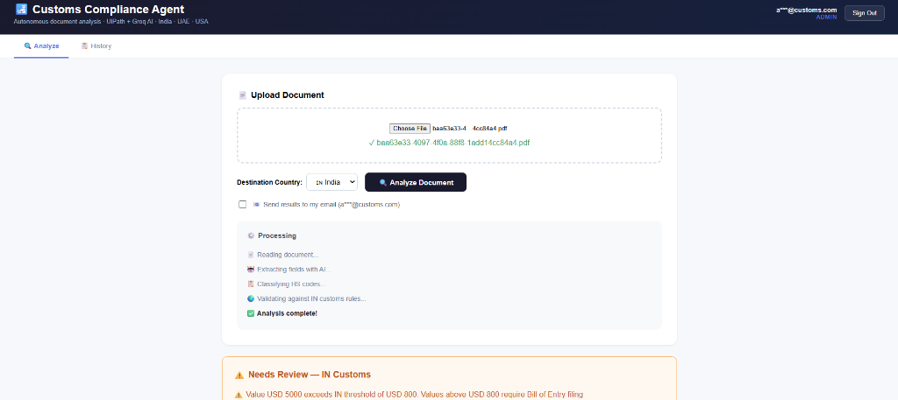
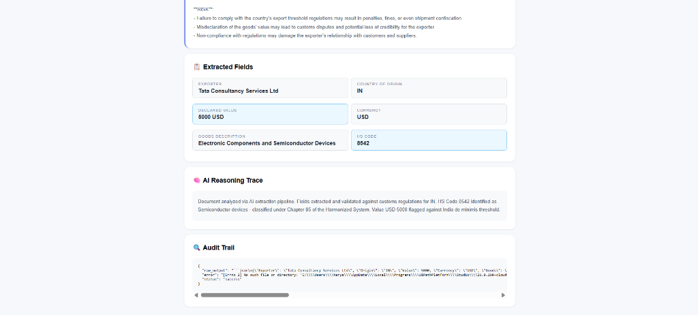
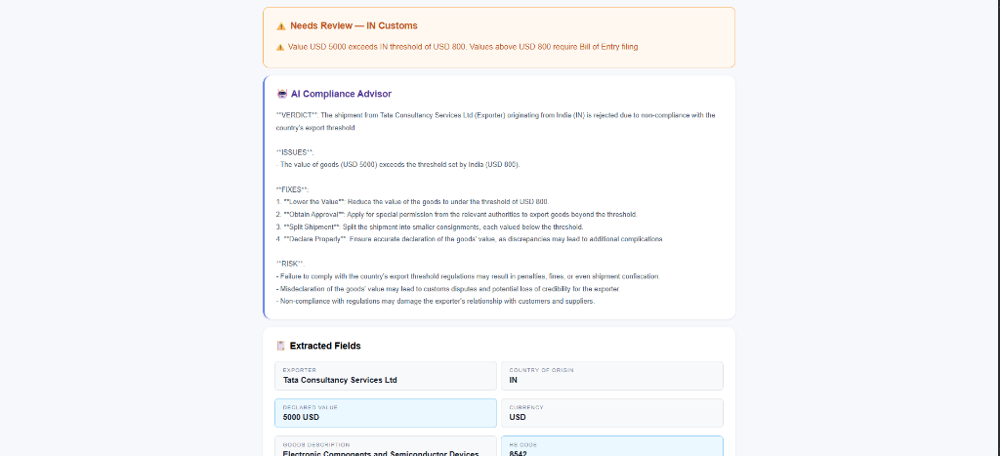

# Customs Compliance Agent

## Problem Statement
Build an AI agent that extracts, validates, and generates customs-compliant documentation from invoices and bills of lading.

## Solution
Autonomous customs compliance platform with UiPath document processing, Groq AI classification, Redis queue with parallel workers, JWT authentication, Multi-Factor Authentication (OTP), local DB encryption, and multi-country validation.

## Tech Stack
- Frontend: React.js (Docker)
- Backend: FastAPI Python (Docker) utilizing MVC architecture
- AI Orchestration: UiPath + Groq LLaMA 3.1
- Queue: Redis + RQ (2 parallel workers, atomic pickup, idempotency)
- Auth: JWT + bcrypt + RBAC (Admin/User roles) + MFA OTP via SMTP
- Database: SQLite (users.db, scans.db) with Singleton Connection Pools
- Encryption: Fernet Symmetric Encryption for DB PII data
- Container: Docker + docker-compose (single network)

## Architecture
- **MVC Pattern**: Backend codebase organized strictly into `models/`, `controllers/`, and `routes/`.
- **Event-driven pipeline**: Browser → FastAPI → Redis Queue / Direct AI Fallback → UiPath / Groq AI → Result.

## How to Run
1. Start Redis: `docker run -d -p 6379:6379 --name standalone-redis redis:alpine`
2. Configure environment: Copy `docker-compose.example.yml` to `docker-compose.yml` and add actual environment variables, or use `.env`. Ensure `ENCRYPTION_KEY` is set.
3. Start containers: `cd C:\CustomsAgent && docker-compose up --build -d`
4. Start workers (optional legacy queue support): `.\start_workers.ps1`
5. Open: `http://localhost:3000`

## API Endpoints
| Method | Endpoint | Description | Auth |
|--------|----------|-------------|------|
| POST | /auth/register | Register user | No |
| POST | /auth/login | Login, triggers MFA if enabled | No |
| POST | /auth/verify-otp | Verify short-lived OTP tokens | No |
| POST | /auth/refresh | Refresh token | No |
| GET | /auth/me | Current user (with masked PII) | Yes |
| POST | /analyze | Analyze document | Yes |
| GET | /job/{id} | Job status | Yes |
| POST | /explain | AI compliance advice | Yes |
| GET | /history | Scan history | Yes |
| GET | /health | System health | No |

## Security & Tracing
- **JWT & Roles**: Access tokens (30 min expiry), Refresh tokens (7 days), Admin/User scopes.
- **MFA (OTP via Email)**: Integrated SMTP Email pipeline capable of dispatching 6-digit verifications.
- **PII Encryption**: Raw email IDs are dynamically encrypted at rest within `users.db` via `cryptography.fernet`.
- **Data Protection**: PII is deeply masked before dispatch in API payloads (e.g., `u***@domain.com`).
- **Distributed Logging & Tracing**: All API calls assign UUID `X-Request-ID` headers and log latency/status natively down to `/logs/app.log` mount volumes.

## Scalability
- **Connection Pools**: SQLite operates over safely persisted singletons (`check_same_thread=False`).
- **Parallel Workers**: Redis queue designed for horizontal atomic scaling without duplicate processing conflicts.

## Countries Supported
- India (IN) — threshold USD 800, Bill of Entry required above
- UAE — threshold USD 1000, VAT registration required
- USA — threshold USD 800, Section 321 de minimis applies

## Screenshots

### Document Upload & Processing pipeline

### Real-Time Extracted Fields & Trace

### Robust AI Compliance Advisor & Audit Trail

